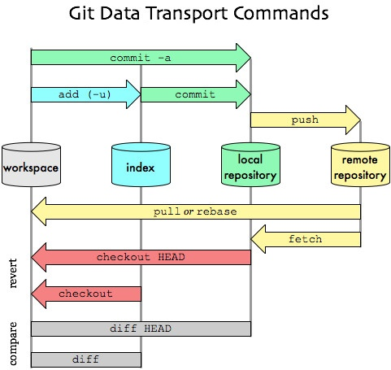

create a new repository `git init`

to clone a repository `git clone <repository>`

to prepare the specific content staged for the next commit 
```
git add <file>
git add .  # add all files
git add -u . # add only modified file, no the new ones
git add -A # add all files
```

Show the working tree status, more in details the differencies between:
- index file and the current HEAD commit
- working tree and the index file
- working tree and not tracked file by Git
```
git status
```
Record changes to the repository
```
git commit -m "message del commit" # use a specific commit git commit -c HEAD # it use the last commit message
```
Show commit logs `git log`

Show the actual branch and list all the available branches  `git branch`

Change the current branch
`git checkout <branch>`

Update the current branch with the latest changes from the remote repository:
`git pull`

Upload local changes to the remote repository:
```git push```

Join two or more development histories together `git merge`
If you have executed git merge and encountered conflicts that you don't want to resolve, you can cancel the merge and revert to the previous state before starting the merge. You can do this using the `git merge --abort` command. This command will return your branch to the state it was in before the merge started. All changes made during the merge attempt will be discarded.

<details>
<strong> Details </strong>

During the resolution of the conflict, remember that:

- "Keep Current" —> means those from the main branch (the branch you are rebasing onto).
- "Accept Incoming" —> means those from the secondary branch that branched off the main branch you are rebasing onto.
- "Accept Combination (Current First)" —> means merging them with priority given to the current (main) branch.
- "Accept Combination (Incoming First)" —> means merging them with priority given to the secondary branch

</details>


## Basic example 

I created the 0_base_commands.md file 
```
git add .
or 
git add 0_base_commands.md

git commit -m <message>
git push 
```

## New Branch example

```
git branch feature-branch #create a new branch "feature-branch"
git checkout feature-branch # switch to new branch 
```
or 
```
git checkout -b feature-branch # create and switch to new branch 
```

edit something 
```
git add .
git commit -m <mesage>
git push
git checkout main
git merge feature-branch
git push 
```

# List of terms that could be useful to know

- **Workspace or Working tree:** is the directory tree of (source) files that you see and edit.
- **Index (Staging Area): ** it is an intermediate area where changes are prepared before being committed. It serves as a staging ground for modifications.
- **HEAD:** A special pointer that indicates the latest commit in the currently checked-out branch. It represents the most recent state of the project and is used as a reference for creating new commits.

